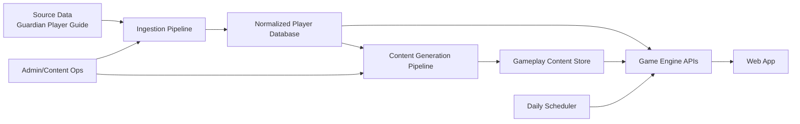
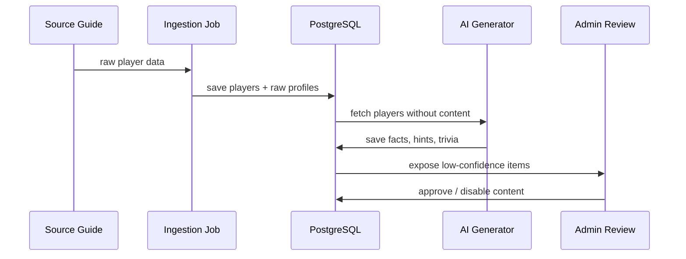
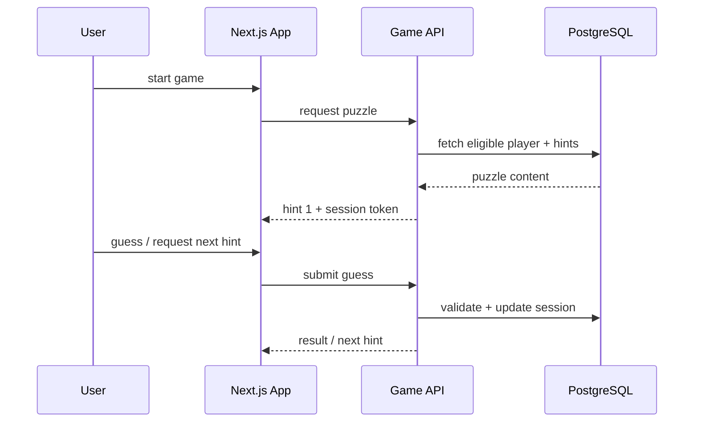

# World Cup Story Trivia Architecture

## 1. เป้าหมายของสถาปัตยกรรม

สถาปัตยกรรมนี้ถูกออกแบบจากเอกสารโครงการเพื่อรองรับเป้าหมายหลัก 4 อย่าง

1. เปลี่ยนข้อมูล `player stories` ให้กลายเป็นคอนเทนต์เกมได้อัตโนมัติ
2. ส่งมอบ `Who Am I?` MVP ได้เร็วที่สุด
3. ขยายไปสู่ `Daily Challenge`, `World Cup Wordle`, `Story Trivia` และโหมดใหม่ได้โดยไม่รื้อระบบ
4. แยกส่วนข้อมูล, การสร้างคอนเทนต์, และเกมเพลย์ออกจากกัน เพื่อให้ดูแลง่ายและเพิ่มข้อมูลผู้เล่นได้ต่อเนื่อง

---

## 2. Architectural Principles

- `Content-first`: สินทรัพย์สำคัญที่สุดคือเรื่องราวของนักเตะ ไม่ใช่แค่ metadata
- `Data normalized once, reused everywhere`: ทำความสะอาดข้อมูลครั้งเดียว แล้วใช้ร่วมกันทุกโหมดเกม
- `Mode-driven architecture`: แต่ละเกมโหมดใช้ rule engine ของตัวเอง แต่แชร์ฐานข้อมูลและ content pool เดียวกัน
- `AI as an offline/async pipeline`: AI ไม่ควรอยู่บน critical path ของการเล่นเกมทุกครั้ง
- `Deterministic daily gameplay`: Daily Challenge ต้องสุ่มแบบคงที่ในแต่ละวันเพื่อให้ทุกคนได้โจทย์เดียวกัน
- `Progressive complexity`: เริ่มจาก monolith ที่จัด boundaries ดี แล้วค่อยแยก service เมื่อมีโหลดจริง

---

## 3. Recommended High-Level Stack

### Frontend

- `Next.js`
- `React`
- `TypeScript`
- `Tailwind CSS`

### Backend

- `Next.js API routes` หรือ `NestJS/Express` แยกเป็น backend app
- `Node.js`
- `PostgreSQL`
- `Redis` สำหรับ cache และ daily/session state ในระยะถัดไป

### AI / Content Pipeline

- `OpenAI API` สำหรับสกัด facts, hints, trivia, distractors
- optional local model สำหรับงาน batch ต้นทุนต่ำ

### Operations

- `Vercel` สำหรับ frontend/fullstack Next.js
- `Supabase` หรือ `managed PostgreSQL` สำหรับ database
- `Cron job` สำหรับ daily challenge generation
- Object storage สำหรับ raw source files ถ้ามีการ ingest หลายรอบ

---

## 4. System Context



---

## 5. Logical Architecture

สถาปัตยกรรมที่เหมาะกับระยะแรกคือ `modular monolith` แยกเป็น 6 bounded modules

### 5.1 Ingestion Module

หน้าที่:

- รับข้อมูลดิบจาก source
- parse/clean ข้อมูลนักเตะ
- map fields ให้เป็น schema กลาง
- เก็บ raw text และ ingestion version

input:

- ชื่อนักเตะ
- ทีมชาติ
- สโมสร
- อายุ
- position
- rating
- story text
- fun facts
- nickname
- personal background
- career notes

output:

- `players`
- `player_profiles`
- `player_story_facts`
- `ingestion_jobs`

### 5.2 Content Generation Module

หน้าที่:

- ดึงข้อมูล story ของนักเตะ
- สกัด facts เชิงโครงสร้าง
- generate hints หลายระดับ
- generate trivia questions
- generate multiple choice options
- score difficulty และ uniqueness

หลักการ:

- ทำงานแบบ async batch
- เก็บผลลัพธ์ทุกชิ้นใน DB
- มี human review flag สำหรับคอนเทนต์ที่ AI สร้างไม่มั่นใจ

output:

- `hint_sets`
- `trivia_questions`
- `daily_candidates`
- `content_quality_scores`

### 5.3 Game Mode Module

แยก rules ตามโหมด แต่ใช้ shared repositories

submodules:

- `who-am-i-engine`
- `wordle-engine`
- `story-trivia-engine`
- `challenge-engine`

แต่ละ engine ควรรับ:

- player pool
- content constraints
- mode config
- difficulty rules

และคืนค่า:

- puzzle payload
- validation rules
- result summary

### 5.4 Daily Challenge Module

หน้าที่:

- เลือกโจทย์ประจำวันจาก content pool
- lock challenge ตามวันที่
- ป้องกันการซ้ำเร็วเกินไป
- สร้าง share result string

กติกาหลัก:

- ใช้ `date + mode + salt` เป็น seed
- บันทึก `daily_challenges` ล่วงหน้าอย่างน้อย 7-30 วัน

### 5.5 Player Session & Analytics Module

หน้าที่:

- เก็บ progress ของผู้เล่น
- attempts
- completion time
- streak
- share events
- mode popularity

MVP อาจเริ่มด้วย anonymous session ก่อน login

### 5.6 Admin / Content Ops Module

หน้าที่:

- re-run ingestion
- trigger AI generation
- review low-confidence content
- disable bad questions
- inspect player profile completeness

---

## 6. Suggested Data Model

### Core Entities

#### `players`

- `id`
- `slug`
- `full_name`
- `national_team`
- `club`
- `position`
- `age`
- `height_cm`
- `preferred_foot`
- `rating`
- `status`
- `source_version`
- `created_at`
- `updated_at`

#### `player_profiles`

- `player_id`
- `raw_story`
- `raw_fun_facts`
- `raw_background`
- `raw_career_notes`
- `raw_nickname`
- `normalized_summary`

#### `player_story_facts`

- `id`
- `player_id`
- `fact_type`
- `fact_text`
- `fact_value`
- `source_text`
- `confidence_score`
- `is_verified`

ตัวอย่าง `fact_type`

- `nickname`
- `pet`
- `favorite_book`
- `food_preference`
- `childhood_background`
- `previous_sport`
- `hobby`
- `family_detail`

#### `hint_sets`

- `id`
- `player_id`
- `mode`
- `difficulty`
- `hint_order`
- `hint_text`
- `source_fact_id`
- `quality_score`

#### `trivia_questions`

- `id`
- `player_id`
- `question_type`
- `question_text`
- `correct_answer`
- `choice_a`
- `choice_b`
- `choice_c`
- `choice_d`
- `difficulty`
- `quality_score`
- `is_active`

#### `daily_challenges`

- `id`
- `challenge_date`
- `mode`
- `player_id`
- `content_ref_id`
- `seed`
- `status`

#### `game_sessions`

- `id`
- `session_token`
- `mode`
- `challenge_id`
- `player_id`
- `started_at`
- `completed_at`
- `attempt_count`
- `success`
- `score`

---

## 7. API Boundary

ถ้าเริ่มด้วย Next.js เต็มระบบ แนะนำแบ่ง API ตาม capability ไม่ใช่ตามหน้า UI

### Public Gameplay APIs

- `GET /api/modes/who-am-i/play`
- `POST /api/modes/who-am-i/guess`
- `GET /api/modes/wordle/play`
- `POST /api/modes/wordle/guess`
- `GET /api/modes/story-trivia/play`
- `POST /api/modes/story-trivia/answer`
- `GET /api/daily/:mode`
- `POST /api/share-result`

### Content APIs

- `GET /api/players/:slug`
- `GET /api/countries`
- `GET /api/modes`

### Admin APIs

- `POST /api/admin/ingestion/run`
- `POST /api/admin/content/generate`
- `POST /api/admin/content/review/:id`
- `POST /api/admin/daily/rebuild`

---

## 8. Runtime Flow

### 8.1 Offline Content Pipeline



### 8.2 Who Am I Gameplay Flow



### 8.3 Daily Challenge Flow

- scheduler สร้าง daily challenge ทุกวัน
- challenge ถูกตรึงด้วย seed และ date
- frontend ดึง challenge ของวันนั้น
- backend validate ว่า user เล่น challenge ไหนอยู่
- เมื่อจบเกม backend สร้างข้อความ share ได้ทันที

---

## 9. Frontend Architecture

### App Layers

- `app/` หรือ `pages/` สำหรับ routes
- `features/gameplay` สำหรับ mode-specific UI
- `features/daily` สำหรับ daily challenge
- `features/player` สำหรับ player card / reveal screen
- `features/share` สำหรับ social sharing
- `lib/api` สำหรับ data fetching
- `lib/game` สำหรับ shared client-side rules

### UI Pages

- Home
- Choose Mode
- Daily Challenge
- Practice Mode
- Country Challenge
- Game Screen
- Result Screen
- Stats / Streak

### State Strategy

- server state: `React Query` หรือ Next server actions
- ephemeral game state: local component state / reducer
- persistent local state: localStorage สำหรับ anonymous streak และ preferences

---

## 10. Mode Design Strategy

### Who Am I? MVP

พึ่งพาข้อมูลแค่:

- player identity
- ordered hints
- guess validation

นี่คือโหมดที่ควรสร้างก่อน เพราะ dependency ต่ำสุด

### World Cup Wordle

เพิ่ม rule comparison layer:

- exact match
- near match
- ordered numeric hint เช่น อายุมากกว่า/น้อยกว่า

ควรมี utility กลางชื่อประมาณ `attributeComparator`

### Story Trivia

ใช้ content pool แบบ question-answer

ต้องมีระบบ:

- distractor generation
- question quality filtering
- duplicate detection

---

## 11. Non-Functional Requirements

### Performance

- API ตอบ puzzle แรกภายใน 300-500ms
- ใช้ pre-generated content แทน real-time AI
- cache daily challenge และ popular query

### Reliability

- AI generation failure ต้องไม่ทำให้เกมล่ม
- content ทุกชิ้นมีสถานะ `draft`, `approved`, `disabled`
- fallback ไปยัง metadata-based hints ได้ถ้า story hints ยังไม่พร้อม

### Scalability

- รองรับ player > 1,200 คนได้ตั้งแต่แรก
- schema ต้องรองรับ content หลายชิ้นต่อผู้เล่น
- mode ใหม่ต้องเพิ่มผ่าน new engine ไม่แก้ core DB หนัก

### Observability

- log ingestion job
- log AI generation cost/time
- analytics per mode
- content defect tracking

---

## 12. Security & Data Governance

- เก็บ API key ฝั่ง server เท่านั้น
- จำกัด admin endpoints
- เก็บ source attribution ต่อ player/fact
- ถ้ามี scraping เพิ่ม ต้องแยก raw source และ normalized output ชัดเจน

---

## 13. Recommended Delivery Roadmap

### Phase A: Foundation

- ตั้ง schema `players`, `player_profiles`, `player_story_facts`
- ทำ ingestion pipeline
- ทำ admin page สำหรับตรวจข้อมูลนักเตะ

### Phase B: Content Engine

- สร้าง fact extraction
- สร้าง hint generation
- สร้าง quality scoring
- ทำ review workflow แบบง่าย

### Phase C: MVP

- สร้าง `Who Am I?`
- สร้าง practice mode
- สร้าง anonymous session
- สร้าง result sharing

### Phase D: Retention

- สร้าง Daily Challenge
- เพิ่ม streak / stats
- ป้องกันโจทย์ซ้ำ

### Phase E: Expansion

- เพิ่ม World Cup Wordle
- เพิ่ม Story Trivia
- เพิ่ม Country Challenge
- เพิ่ม Player Cards

---

## 14. Recommended Repository Structure

```text
world-cup-story-trivia/
  apps/
    web/
  packages/
    ui/
    game-engine/
    content-engine/
    data-access/
    shared-types/
  scripts/
    ingest/
    generate-content/
    seed-daily/
  docs/
    architecture.md
    data-model.md
    api-spec.md
```

ถ้าต้องการเริ่มให้เบากว่านี้ สามารถใช้ repo เดียวก่อน:

```text
src/
  app/
  features/
  server/
    modules/
      ingestion/
      content/
      gameplay/
      daily/
      analytics/
  lib/
  types/
```

---

## 15. Final Recommendation

ข้อเสนอที่เหมาะที่สุดสำหรับโปรเจ็กต์นี้คือ:

- เริ่มด้วย `Next.js + TypeScript + PostgreSQL`
- วางระบบเป็น `modular monolith`
- แยก 4 แกนหลักตั้งแต่วันแรก:
  - `ingestion`
  - `content generation`
  - `game engines`
  - `daily challenge`
- ใช้ AI แบบ `batch/offline generation` ไม่เรียกสดทุกตาเกม
- ส่งมอบ `Who Am I?` ก่อน แล้ว reuse content layer ไปต่อยอด `Wordle` และ `Story Trivia`

สรุปสั้นที่สุด:

`Player Story Database -> Fact Extraction -> Content Pool -> Game Engine APIs -> Web Game UI`

นี่คือเส้นสถาปัตยกรรมที่ตรงกับวิสัยทัศน์ในเอกสารมากที่สุด และยังคุมความซับซ้อนของ MVP ได้ดี
